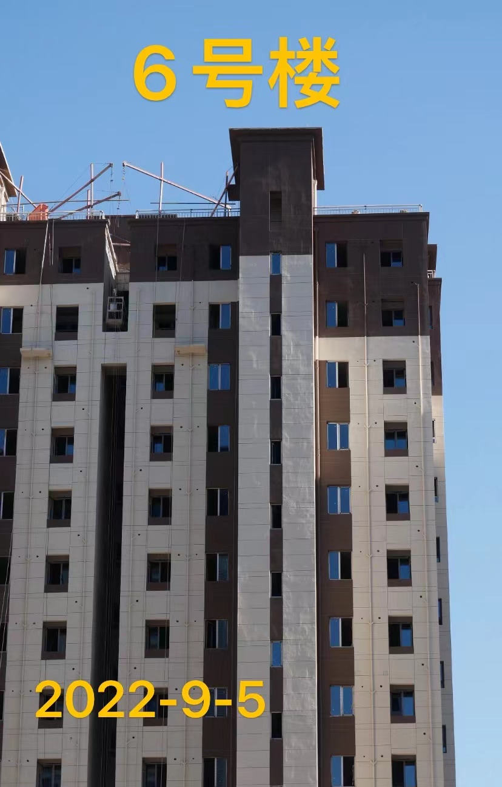

# Mingyue-Bay-is-sick
```java
京能电建洺悦湾生病了
```


# 触目惊心的病况


 - 该项目自外立面开始施工起，业主发现在建的楼栋外立面出现明显凹凸不平、鼓包、透底、颜色不一等情况。多次向开发商和区质监站投诉反馈后，均被以检测合格为由搪塞，拒不整改，肉眼可见的外立面不平整问题视而不见听而不闻，指鹿为马，外立面观感质量不如回迁房。


## 2022 年 9 月照  



# 项目概况
- 京能电建洺悦湾
    北京市大兴区地铁亦庄线旧宫东站2号地块DX05-0102-6003、6004、6005地块项目
- 甲方：北京京能海赋置业有限公司  (京能+电建子公司)
- 承建方(总包)：北京建工集团有限责任公司    
- 开盘日期：2020 年 6月 
- 销售均价：5.4W
- [电建地产官网](http://fdc.powerchina.cn/)
- [京能置业官网](http://beh-zy.com/)

# 维权历程
- 2022 年 9 月 11 日，二十余位业主中秋节假日之际自发相约洺悦湾对自己买的房子质量如何进一步进行监督进行商谈，开发商手段无所不用其极。预先在业主群内布置假业主获取业主动向，派假业主混迹在真业主当中混淆视听，常用恐吓手段以为报警能吓走和驱散众位业主，浪费社会警力资源(到场三两警车以及两辆以上的治安巡逻车)。换做其他警察可能就真驱赶了就算完事，时任大兴区红星派出所丁副所长，并不是驱散群众聚集，其实完成驱散便算是完成了工作，而是指挥协调和倾听人民群众声音，想办法从根源上解决人民群众困难和诉求。协调开发商和业主就主要的外立面等主要矛盾问题进行了会议沟通，协助建立长效沟通机制。面对会谈出面客服经理王洋社会人态度及时纠错，客服就要就客服的态度，不能买房前是大爷供着哄着，几百万血汗积蓄托付给你后变成了孙子，真要没什么质量问题业主也没闲功夫中秋节团圆之际不陪家人而来项目地，期望此次会议后开发商能痛定思痛拿出切实可行的实际解决问题的方案和态度，解决洺悦湾外立面问题主要矛盾！
    
- 会后众位业主离开售楼处后，开发商方提出请民警同志吃饭，民警同志遂拒绝。刚正不阿、严于律己、公正公平，人民警察是人民的警察。在大是大非面前
    在辖区内一千二百多户近五千人民群众的血汗财产面前不会被一切糖衣炮弹侵蚀，给出了一个民众所期待的首都人民警察形象~！给大兴区红星派出所点赞~！

- 2022 年 8 月约 100 名业主联名发布律师函，开发商冷处理。针对律师函无回复
- 2022 年 4 月 9 日召开园林推介会，几张 ppt 敷衍到现场业主，对业主提出的问题说研究，还记录了一张纸条问题多大 10 余项，后续无全面逐一回复


# 媒体声音


[微博-京能电建洺悦湾怎么了](https://m.weibo.cn/u/3939078745?from=10C9095010&wm=9006_2001&sourceType=weixin)


# 投诉渠道
- 12345
- 领导留言板
- 大兴区住房和城乡建设委员会 联系电话 69243727 
- 大兴区住房和城乡建设委员会 投诉电话 69261330
- 北京市大兴区建设工程质量监督站 69235447
- 施工单位信访电话 13910147998
- 北京京能海赋置业有限公司 项目负责人 周生 联系电话 13501108927 
- 北京建工集团有限责任公司 项目负责人 蒙生 联系电话 15001399800

# 法律
- 洺悦湾全体业主将保留法律手段合法维护自己的权益


## 地方法规
[京建发〔2022〕134号《北京市住房和城乡建设委员会关于进一步加强房屋建筑外墙外保温工程施工质量管理工作的通知》](http://zjw.beijing.gov.cn/bjjs/gcjs/tzgg36/325818509/index.shtml)


# 业主诉求
1、项目楼体外立面凹凸不平。
项目开发商违反了北京市住建委在22年4月29日下发的《关于进一步加强房屋建筑外墙外保温工程施工质量管理工作的通知》京建发【2022】134号文，饰面施工没有优先选择建筑的日照面进行样板施工，拒不对问题楼面进行修改。洺悦湾项目在楼体外立面喷涂真石漆的过程中，基层平整度不达标，外墙保温板固定后没有做精细找平，玻璃纤维网和抗裂砂浆层完毕后，没有做精细找平。导致喷涂后的外墙在阳光下明显凹凸不平。多次投诉至大兴建委后，开发商以项目施工未完等借口，拒不整改。但实际上大部分完成涂装的楼面都有问题。

2、项目施工不设立工地开放日。
项目自预售至今已经2年多的时间，至今没有进行过一次工地开放，拒不接受业主的监督。对业主要求设立工地开放日的要求各种推诿，拒不执行北京市住建委关于设立工地开放日的规定。根据北京市住房城乡建设委员会2021年8月下发的《关于进一步规范新建商品住房销售行为的通知》京建发〔2021〕258号文，广大业主要求开发商立刻设立工地开放日，每月一次，每次由业主自愿报名，不超过5人为限。

## 业主声音

- 在17年北京房产新政后，北京的房价已经趋于平稳，洺悦湾全体业主响应遵守习总书记提出的房主不炒的政策，购买限竞房都是 5 年以后才能进行交易，所以大部分业主都是自住需求，另外购置新房也是对北京市、对大兴区的土地财政做贡献！现在情况十万火急，作为弱势群体的一方，作为买期房等于开盲盒的一方、洺悦湾全体 1300 多户业主、5000人民群众，将在党和政府的领导下、街道社区和公安的指导下进行尊法、守法、合法、合理进行维权，永远相信党和政府会站在人民群众这边！


# 洺悦湾诗集

```java
京能电建洺悦湾
大家都来观一观
真石漆来刷外墙
太阳一出心拔凉
```
```java
京能电建洺悦湾
虚假宣传口碑烂
墙面不平质量残
沟通均无功而返
开发商们头朝天
罔顾业主血汗钱
迫不得已要维权
买房务必擦亮眼
```

```java
精能电贱，坑蒙拐骗。投诉万遍，视而不见。手画腰线，生无可恋。着急变现，不要脸面。
```


# 贡献榜单
- 为维权募集经费贡献榜单(排名不分先后)。

## 费用支出公示

# 避坑指南
- 北京峯范
- 电建西山源著
- 京能龙湖熙上
- 京能西山印
- 小瓦窑华曦府

# 素材引用
部分图片来自网络，如有侵权请联系 623414533@qq.com 删除。


